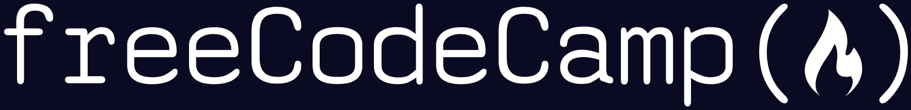
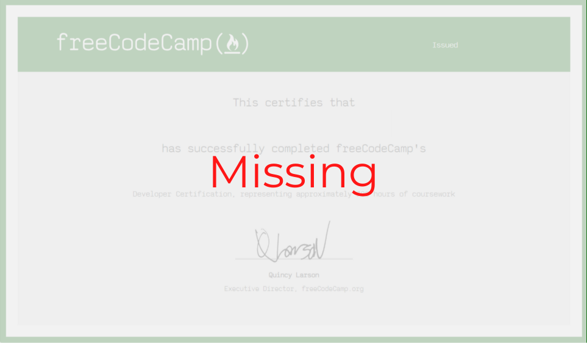

# Freecodecamp Projects

<figure>
  
  <figcaption>
  <em>freeCodeCamp (also referred to as “Free Code Camp”) is a non-profit organization that consists of an interactive learning web platform, an online community forum, chat rooms, online publications and local organizations that intend to make learning web development accessible to anyone.</em>
  </figcaption>
</figure>

 

I strongly believe we learn from pratice. So I chose the freeCodeCamp platform to be my place to practice and really learn about all topics (especially *web development*) that I'm interesed in. (And because it's _free_ 😉) 

 

<table>
  <thead>
  <tr>
    <th>Certification Name</th>
    <th>Projects</th>
    <th>Status</th>
    <th>Certification</th>
  </tr>
  </thead>
  <tbody>
  <tr>
    <td rowspan="5">Responsive Web Design</td>
    <td><a href="https://mathsantana.github.io/freecodecamp-projects/responsive-web-design/tribute-page" alt="Tribute Page" >Tribute Page</td>
    <td>DONE</td>
    <td rowspan="5"> </td>
  </tr>
  <tr>
    <td>Survey Form</td>
    <td>NOT DONE</td>
  </tr>
  <tr>
    <td>Product Landing Page</td>
    <td>NOT DONE</td>
  </tr>
  <tr>
    <td>Technical Documentation Page</td>
    <td>NOT DONE</td>
  </tr>
  <tr>
    <td>Personal Portfolio Webpage</td>
    <td>NOT DONE</td>
  </tr>

  </tbody>
</table>